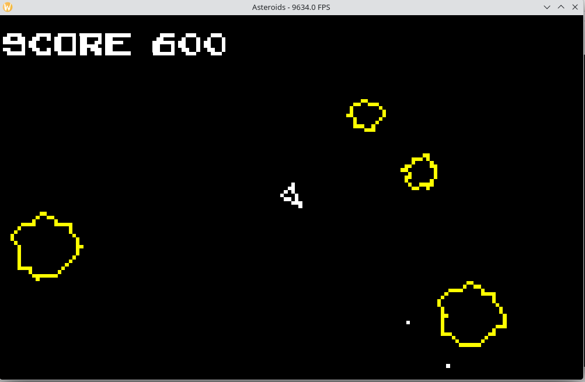

# AsteroidsSDL3
Asteroids 2D using vector graphics and wireframe model rendering with C++ and SDL3

```powershell
g++ -Iinclude -Llib src/*.cpp -lSDL3 -lSDL3_ttf -o asteroids
```

<br><br><br><br>

